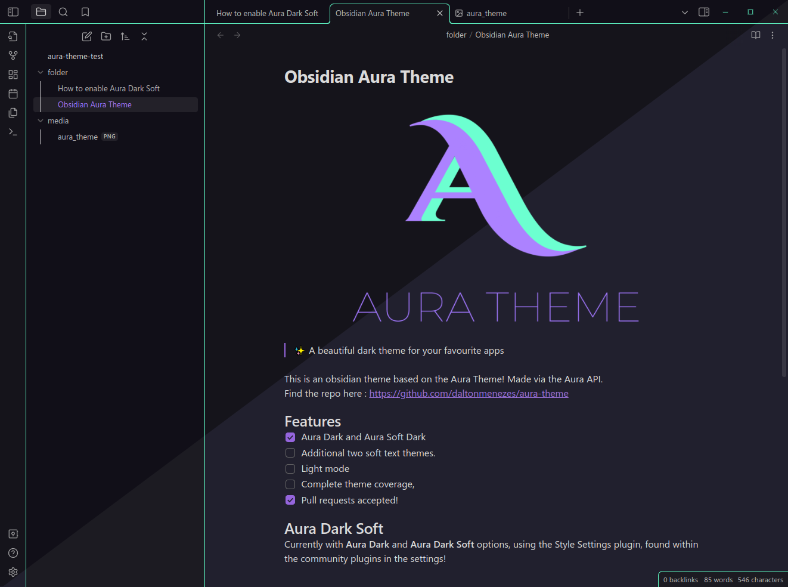
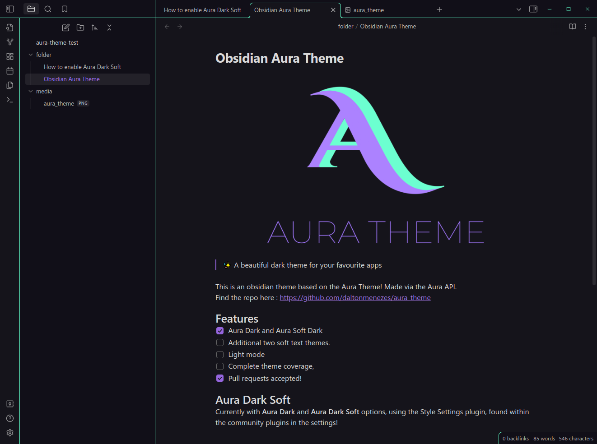
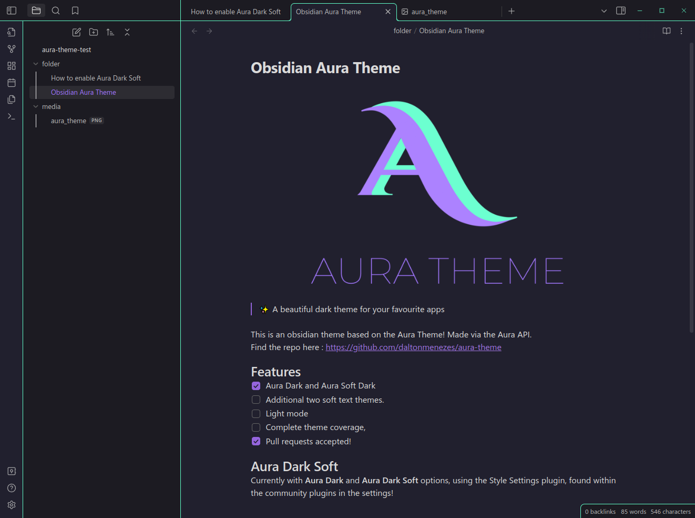

>✨ A beautiful dark theme for your favourite apps

This is an Obsidian theme based on the Aura Theme! Made via the Aura API.
Find the repo here : https://github.com/daltonmenezes/aura-theme
## Features
- [x] Aura Dark and Aura Dark Soft
- [x] Other tweaks via plugins!
- [ ] Additional two soft text themes
- [ ] Light mode 
- [ ] Complete theme coverage
- [x] Pull requests accepted! 

## Aura Dark Soft

Currently with **Aura Dark** and **Aura Dark Soft** options, using the Style Settings plugin, found within the community plugins in the settings!
### Enable Aura Dark Soft
1. Go to settings
2. In the "Community plugins" tab
	1. Click "Enable Community Plugins" if you haven't already
3. Hit browse and search for "Style Settings", and then install it
4. At the bottom of the page enable the "Style Settings" plugin
5. Go to the "Style Settings" tab in the bottom left, open the Aura Theme section and change from Aura Dark to Aura Dark Soft. 

## Known Issues: 
- Search Bar themeing
- Turn On/Turn Off buttons aren't themed correctly.
- Top 3 icons (files, search, bookmarks) aren't correctly coloured when highlighted
- Cyan line highlights doesn't change to be soft when in Aura Dark Soft (more css knowledge needed)
